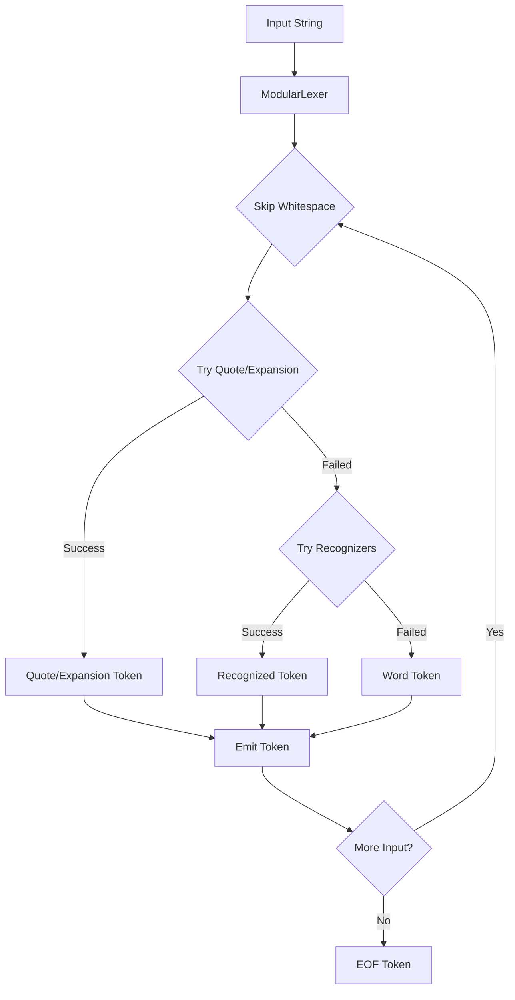

# PSH Lexer Architecture Documentation

## Overview

The PSH lexer is a modular tokenization system designed to handle the complex syntax of POSIX shells while maintaining clarity and extensibility.

## Architecture Principles

1. **Modularity**: Components are loosely coupled with well-defined interfaces
2. **Extensibility**: New token types and recognizers can be added without modifying core logic
3. **Context Awareness**: Rich metadata and state tracking throughout tokenization
4. **Error Recovery**: Graceful handling of malformed input with detailed error context
5. **Performance**: Efficient token recognition with ordered recognizer dispatch
6. **Clarity**: Clean separation of concerns with modular architecture

## Architecture Diagram

```
┌─────────────────────────────────────────────────────────────────┐
│                         Input String                             │
└─────────────────────────────────────┬───────────────────────────┘
                                      │
                                      ▼
┌─────────────────────────────────────────────────────────────────┐
│                      Position Tracker                            │
│  - Line/column tracking                                          │
│  - Unicode-aware positioning                                     │
│  - Error location reporting                                      │
└─────────────────────────────────────┬───────────────────────────┘
                                      │
                                      ▼
┌─────────────────────────────────────────────────────────────────┐
│                    State Management Layer                        │
│  ┌──────────────────────────────────────────────────────────┐  │
│  │  LexicalState (state_context.py; alias LexerContext)      │  │
│  │  - role (command-position axis) + case FSM + depths       │  │
│  │  - single mutator: command_position.advance_lexical_state │  │
│  └──────────────────────────────────────────────────────────┘  │
└─────────────────────────────────────┬───────────────────────────┘
                                      │
                                      ▼
┌─────────────────────────────────────────────────────────────────┐
│                    Recognition Pipeline                          │
│  ┌─────────────────────────────────────────────────────────┐   │
│  │              Quote & Expansion Parsers                   │   │
│  │  ┌──────────────────┐  ┌─────────────────────────┐     │   │
│  │  │ UnifiedQuoteParser│  │   ExpansionParser      │     │   │
│  │  │ - Single quotes   │  │ - Variables ($VAR)     │     │   │
│  │  │ - Double quotes   │  │ - Parameters (${VAR})  │     │   │
│  │  │ - ANSI-C quotes  │  │ - Command sub $(...)   │     │   │
│  │  └──────────────────┘  │ - Arithmetic $((...)    │     │   │
│  │                         │ - Process sub <(...) >(..)    │   │
│  │                         └─────────────────────────┘     │   │
│  └─────────────────────────────────────────────────────────┘   │
│                                                                  │
│  ┌─────────────────────────────────────────────────────────┐   │
│  │       Modular Token Recognizers (dispatch order)         │   │
│  │  ┌────────────────┐  ┌────────────────┐  ┌────────────┐│   │
│  │  │1 Process Sub   │→ │2 Operator Rec  │→ │3 Literal   ││   │
│  │  └────────────────┘  └────────────────┘  └────────────┘│   │
│  │  ┌────────────────┐  ┌───────────────────────────────┐ │   │
│  │  │4 Comment Rec   │→ │5 OperatorDebris (tried last)  │ │   │
│  │  └────────────────┘  └───────────────────────────────┘ │   │
│  │  (keywords are a post-pass; whitespace is skipped early)│   │
│  └─────────────────────────────────────────────────────────┘   │
│                                                                  │
│  ┌─────────────────────────────────────────────────────────┐   │
│  │              Recognizer Registry                         │   │
│  │  - Ordered dispatch (registration order = first match)   │   │
│  │  - Dynamic registration                                  │   │
│  │  - Error handling                                        │   │
│  └─────────────────────────────────────────────────────────┘   │
└─────────────────────────────────────┬───────────────────────────┘
                                      │
                                      ▼
┌─────────────────────────────────────────────────────────────────┐
│                     Unified Token Stream                         │
│  - Single Token class with built-in metadata                     │
│  - Context tracking and semantic information                     │
│  - Position information (line, column, offset)                   │
│  - Token parts for composite tokens                              │
└─────────────────────────────────────────────────────────────────┘
```

## Component Architecture

### 1. Core Components

#### ModularLexer (`modular_lexer.py`)
The main orchestrator that coordinates all tokenization activities:
- Manages input position and state
- Integrates quote/expansion parsing with token recognition
- Emits tokens with comprehensive metadata
- Handles error recovery and reporting

```python
class ModularLexer:
    """Main lexer combining modular recognition with unified parsing"""
    def __init__(self, input_string: str, config=None):
        self.config = config or LexerConfig()
        self.position_tracker = PositionTracker(input_string)
        self.registry = RecognizerRegistry()
        self.expansion_parser = ExpansionParser(self.config)
        self.quote_parser = UnifiedQuoteParser(self.expansion_parser)
```

#### LexicalState (`state_context.py`)
Explicit cross-token state the recognizers consult. Its single mutator is
`command_position.advance_lexical_state` (the one lexer-stage command-position /
case transition function). `LexerContext` remains a backward-compatible alias of
`LexicalState`.

```python
class LexicalState:
    """Explicit lexer state (replaced the ad-hoc boolean cluster in R1)."""
    role: LexicalRole                # command-position axis (COMMAND_POSITION / ARGUMENT)
    bracket_depth: int = 0           # [[ ]] nesting
    arithmetic_depth: int = 0        # $((...)) / (( )) nesting
    case_depth: int = 0              # case..esac nesting
    case_expecting_in: bool = False  # between `case` and `in`
    in_case_pattern: bool = False    # collecting case patterns
    posix_mode: bool = False
    # command_position (bool) and case_phase (CasePhase view) are derived
    # read-properties; recognizers read context.command_position unchanged.
```

Quote state is NOT tracked here: quotes are consumed whole by
`UnifiedQuoteParser` within one token, so no cross-token quote state exists.

### 2. Token Recognition System

#### Recognizer Framework (`recognizers/`)
A pluggable token recognition system. Recognizers are tried in **registration
order** — the first to match wins (no priority sorting):

```python
class TokenRecognizer(ABC):
    """Base class for all token recognizers"""
    @abstractmethod
    def can_recognize(self, input_text: str, pos: int, context) -> bool:
        """Fast check: might this recognizer handle the current position?"""
        pass

    @abstractmethod
    def recognize(self, input_text: str, pos: int, context) -> Optional[Tuple[Optional[Token], int]]:
        """Attempt to recognize a token; return (token, new_pos) or None."""
        pass
```

#### RecognizerRegistry (`recognizers/registry.py`)
Manages recognizer registration and dispatch:
- Dispatch in registration order (declared once in `ModularLexer._setup_recognizers`:
  ProcessSub → Operator → Literal → Comment → OperatorDebris; whitespace is
  skipped by the main loop before dispatch, not a recognizer)
- First match wins; a raised exception is a recognizer defect (surfaced with context)

### 3. Quote and Expansion Parsing

#### UnifiedQuoteParser (`quote_parser.py`)
Handles all quote types with configurable rules:
- Single quotes (no expansions)
- Double quotes (allow expansions)
- ANSI-C quotes ($'...' with escape sequences)
- Quote removal and escape processing

```python
QUOTE_RULES = {
    "'": QuoteRules(
        allow_expansions=False,
        allow_escapes=False,
        escape_chars=set(),
        name="single"
    ),
    '"': QuoteRules(
        allow_expansions=True,
        allow_escapes=True,
        escape_chars={'$', '`', '"', '\\', '\n'},
        name="double"
    )
}
```

#### ExpansionParser (`expansion_parser.py`)
Parses shell expansions within appropriate contexts:
- Variable expansions: `$VAR`, `${VAR}`
- Command substitution: `$(...)`, `` `...` ``
- Arithmetic expansion: `$((...))`
- Process substitution: `<(...)`, `>(...)`

### 4. Supporting Infrastructure

#### Position Tracking (`position.py`)
Maintains accurate position information:
- Line and column tracking
- Position snapshots for error reporting
- Efficient position updates
- Unicode-aware character counting

#### Token Parts (`token_parts.py`)
Represents fine-grained token components:
```python
@dataclass
class TokenPart:
    """Represents a part of a composite token"""
    type: PartType
    value: str
    original: str
    quote_context: Optional[str] = None
    is_variable: bool = False
    is_expansion: bool = False
    expansion_type: Optional[str] = None
    error_message: Optional[str] = None
    start_position: int = 0
    end_position: int = 0
```

#### Unicode Support (`unicode_support.py`)
Provides character classification functions:
- POSIX mode vs Unicode mode
- Identifier validity checking
- Whitespace detection across Unicode categories
- Variable name validation

## Unified Token System (v0.91.3)

The unified token system represents the culmination of the Enhanced Lexer Deprecation Plan:

### Token Class Unification
Tokens are **immutable** (`frozen=True`): once emitted they are never mutated —
stages that need a changed token build a new one with `dataclasses.replace`.

```python
@dataclass(frozen=True)
class Token:
    """Unified, immutable token for the lexer and parser."""
    type: TokenType
    value: str
    position: int
    end_position: int = 0
    quote_type: Optional[str] = None
    line: Optional[int] = None
    column: Optional[int] = None
    adjacent_to_previous: bool = False
    is_keyword: bool = False
    parts: List['TokenPart'] = field(default_factory=list)
    fd: Optional[int] = None
    var_fd: Optional[str] = None
    combined_redirect: bool = False
    heredoc_key: Optional[str] = None   # collected-heredoc-body link (None = none)
    array_init: Optional[Any] = None    # combinator `name=(...)` payload

    @property
    def span(self) -> SourceSpan:       # derived view over position/end_position
        return SourceSpan(self.position, self.end_position)
```

### Enhanced Features as Standard
- **Immutable**: frozen dataclass; classification/heredoc-key/retypes use `replace`
- **Source-faithful**: `span` (a `SourceSpan`) reconstructs the lexeme from source
- **Position Information**: line/column stored; `SourceMap` (`position.py`) is the
  one offset → (line, column) + line-text service (lexer + parser error path)
- **Token Parts**: composite token support built-in (`RichToken`, also frozen)

## Token Generation Flow



## Key Design Patterns

### 1. Registry Pattern
The `RecognizerRegistry` dispatches in registration order — the sequence below
IS the dispatch order (first match wins):
```python
registry = RecognizerRegistry()
registry.register(ProcessSubstitutionRecognizer())  # 1. before operators (`<(` ≠ `<`)
registry.register(OperatorRecognizer())             # 2.
registry.register(LiteralRecognizer())              # 3.
registry.register(CommentRecognizer())              # 4.
registry.register(OperatorDebrisWordRecognizer())   # 5. tried strictly last
# (whitespace is skipped by the main loop before dispatch, not a recognizer)
```

### 2. Strategy Pattern
Quote parsing uses configurable rules for different quote types, allowing easy extension.

### 3. Context Object Pattern
`LexicalState` (aliased `LexerContext`) consolidates cross-token state to avoid
parameter explosion and enable clean APIs.


## Configuration System

The lexer is configured through `LexerConfig` (`position.py`). Most historical
feature flags were removed once no caller disabled them; only extglob and posix
are genuinely toggled. The former `strict` (batch/interactive) entry-point flag
was retired in R2 — the two configs had become identical.
```python
@dataclass
class LexerConfig:
    """Configuration for lexer behavior"""
    enable_extglob: bool = False   # `shopt -s extglob`
    posix_mode: bool = False       # `set -o posix` (from shell options)
    case_sensitive: bool = True
```

## Error Handling

The lexer implements sophisticated error handling:
- `LexerError`: Unrecoverable errors requiring termination
- `RecoverableLexerError`: Errors that can be recovered in interactive mode
- Rich error context with position information
- Clear error messages for common issues
- Synchronization points for error recovery

## Token Metadata

Every token includes comprehensive metadata through the unified system:
- Position information (line, column, offset)
- Quote context and nesting depth
- Expansion depth and type
- Semantic type hints
- Command position indicators
- Error information for invalid constructs

## Performance Optimizations

1. **Ordered dispatch**: recognizers tried in a fixed registration order (the most
   discriminating scanners first), first match wins
2. **Character-based early exit**: Quick rejection of impossible tokens
3. **Minimal state copying**: Efficient context management
4. **Lazy metadata creation**: Only populated when needed
5. **String view operations**: Avoid unnecessary string copies
6. **Greedy operator matching**: Longest match first

## Testing Strategy

The modular architecture facilitates comprehensive testing:

### Unit Tests
- State management: Context tracking and transitions
- Pure helpers: All utility functions tested independently
- Quote/expansion parsing: Edge cases and error conditions
- Token recognition: Each recognizer tested in isolation

### Integration Tests
- End-to-end tokenization scenarios
- Cross-component interactions
- Error recovery paths
- Performance benchmarks

### Conformance Tests
- POSIX compliance verification
- Bash compatibility testing
- Token output comparison with reference implementations

## Extension Points

The architecture provides clear extension points:

### 1. New Token Types
```python
# Add to TokenType enum
NEW_TOKEN = auto()

# Create recognizer (no priority — dispatch is registration order)
class NewTokenRecognizer(TokenRecognizer):
    def can_recognize(self, input_text, pos, context):
        return input_text[pos] == '@' and context.is_special_mode

    def recognize(self, input_text, pos, context):
        # Return (token, new_pos) or None
        return Token(TokenType.NEW_TOKEN, value, pos), new_pos

# Register at the right point in ModularLexer._setup_recognizers
# (before anything it must pre-empt, after anything that should win over it)
registry.register(NewTokenRecognizer())
```

### 2. New Quote Types
Extend `QUOTE_RULES` dictionary with custom quote behavior.

### 3. New Expansions
Extend `ExpansionParser` with new expansion types.

### 4. Context Extensions
Add fields to `LexerContext` for new state tracking needs.

## Future Directions

The architecture is designed to support:
- Incremental parsing for better error recovery
- Parallel tokenization for performance
- Language server protocol integration
- Advanced syntax highlighting
- Custom shell dialects
- Real-time tokenization for interactive features

## Conclusion

The PSH lexer architecture represents a maintainable approach to shell tokenization. Its modular design, metadata, and extension points make it a good foundation for both educational purposes and practical shell implementation.

